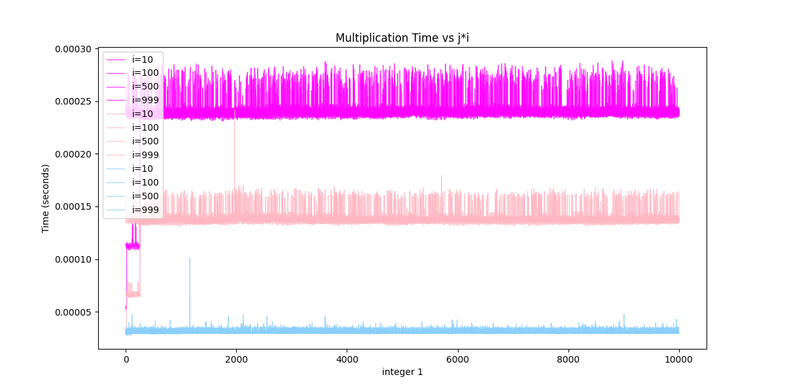
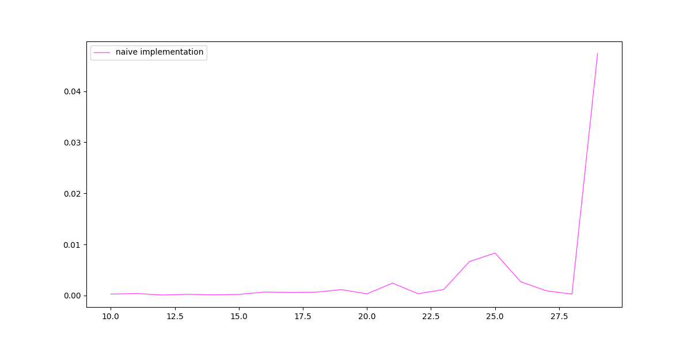
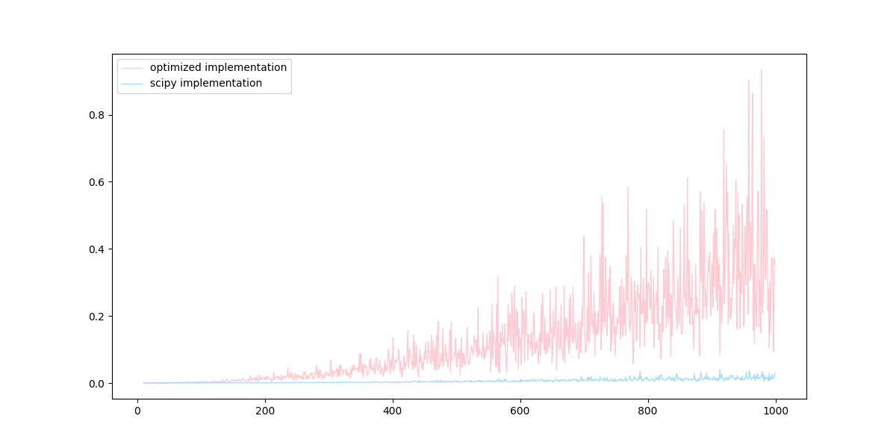

# EECS477 coding project

### Instructions:
In the course schedule, the lectures are color-coded by topic, and some lectures are marked with a (*), meaning they would make interesting coding projects. To do the coding project:
- Pick three (*) lectures in three different color classes.
- Code up the algorithms "as-is", and then experiment with variations and optimizations, various input sets, etcetera.
- Schedule a 30-minute meeting with Professor Pettie before the final exam, and present your findings.
- Submit a github repository.

### Lectures:
- Divide and Conquer: FFT, integer multiplication
- Max Flow: Dinic's blocking flow algorithm
- Nonbipartite Matching: Edmonds' Blossom Algorithm

### Divide and Conquer: FFT, integer multiplication
- the naive implementation can be found here: dc_utils.py
- the optimized version can be found here: dc_opt_utils.py

Below are the optimization strategies for FFT:
 
    1) allocation of space for lists before appending 

    2) list comprehension, slicing/slice assignments instead of expensive loops

    3) computation of even and odd results in a single loop

    4) single division by n instead of computing for each coefficient in inverse fft

The performance of the naive and optimized versions are shown below, and compared to the numpy fft implementation for multiplying ints 0-1000 by ints 0-10000.

The [numpy fft documentation](https://numpy.org/doc/2.1/reference/generated/numpy.fft.ifft.html) can be found here, and I loosely followed the [example here](https://cs.stackexchange.com/questions/156195/multiplying-2-positive-integers-using-fft-and-convolutions#:~:text=In%20the%20context%20of%20using,digits%20(N=1000).).

Magenta: naive implementation, pink: optimized implementation, blue: numpy implementation

### Max flow: Dinitz' blocking flow algorithm
- the naive implementation can be found here: dinitz_utils.py
- the optimized version can be found here: dinitz_opt_utils.py

Below are the optimization strategies for Dinitz' algorithm:

    1) instead of dijkstra's algorithm to find min path length, use BFS to create a level graph, where each node is assigned a level. The only paths considered are those where the next node is of level+1 of current node. Level graphs are introduced in the link below.

    2) Using a level graph then searching for paths using DFS eliminates the need for path enumeration (via get_minpaths and get_allpaths in the naive implementation)

    3) Push flow directly in DFS instead of finding all the blocking flows then push flow after

    4) instead of the naive graph representation i used (dict of dicts), create an adjacency list of lists, then store the capacities in an array

[Introduction to level graphs]([here](https://en.wikipedia.org/wiki/Dinic%27s_algorithm).)

To test, random graph generation was performed by:

The performance of the naive and optimized versions are shown below, and compared to the scipy max flow implementation for graphs with 10 to 1000 vertices (step = 10), with random weights and random number of edges.

### Edmond's blossom algorithm for maximum matchings
- the naive implementation can be found here: blossom_utils.py
